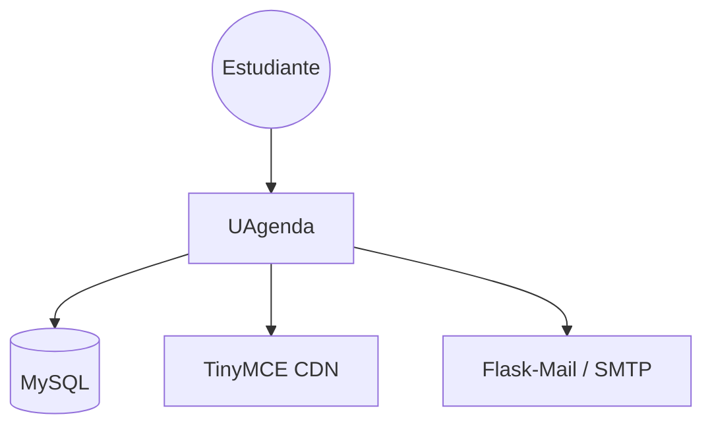

# 01 — Contexto del Sistema: UAgenda

## 1. Propósito del sistema

UAgenda es un HUB de organización académica para estudiantes de la UTadeo.
Centraliza en una sola aplicación web varias herramientas que un estudiante
normalmente maneja dispersas en apps distintas: horario de clases,
calculadora de promedio ponderado, notas/apuntes con editor enriquecido, y
tarjetas de estudio (flashcards) con repetición espaciada básica.

"UAgenda existe para que un estudiante pueda organizar todas sus necesidades en un solo lugar."

## 2. Alcance de esta fase

Este proyecto retoma una base de código preexistente (desarrollada
originalmente en 2023) como sistema base adoptado para la asignatura 
de Arquitectura de Software.
El trabajo de esta fase NO es construir desde cero, sino:

- Operar el sistema base localmente de forma reproducible.
- Identificar y documentar sus atributos de calidad actuales (o su
  ausencia) frente a un framework de requerimientos no funcionales.
- Aplicar mejoras arquitectónicas dirigidas por esos hallazgos.

En esta entrega, no se aborda deploy a producción, únicamente se monta de
manera local y se forman las instrucciones para hacerlo.

## 3. Actores / Stakeholders

| Actor | Rol frente al sistema | Interés principal |
|---|---|---|
| Estudiante (usuario final) | Usa la app día a día | Que funcione, sea rápida, no pierda sus datos |
| Equipo de desarrollo (nosotros) | Mantiene y evoluciona el sistema | Poder trabajar sobre el código sin miedo a romper cosas |
| Docente / evaluador | Evalúa el proceso y el resultado | Evidencia de decisiones arquitectónicas justificadas |

## 4. Sistemas externos con los que interactúa

- **MySQL** — persistencia de datos (usuarios, recordatorios, notas,
  flashcards, horario, notas de calculadora). Actualmente solo se opera
  en local; la instancia de producción original (Clever Cloud) ya no
  está disponible.
- **TinyMCE (CDN)** — editor de texto enriquecido usado en la sección de
  Cuaderno/Apuntes. Se carga desde `cdn.tiny.cloud`, es una dependencia
  externa con su propia clave de API.
- **Flask-Mail** — pensado para el flujo de recuperación de contraseña
  por correo. Su integración aún está pendiente.
- **Fuentes e íconos externos** — Google Fonts, Font Awesome (CDN),
  jQuery y html2canvas (CDN) cargados en varias vistas.

## 5. Restricciones

### Técnicas
- Stack: Python/Flask (backend monolítico, sin capa de servicios
  separada), MySQL, HTML/CSS/JS server-rendered con jQuery — sin
  framework de frontend moderno (no SPA).
- Autenticación por sesión de Flask basada en cookies, sin tokens.
- Sin suite de pruebas automatizadas al día de esta entrega.
- Base de datos solo probada en instalación local; sin entorno de
  staging.

### Organizacionales
- Equipo de 3 integrantes, cursando la materia en
  paralelo con otras asignaturas — disponibilidad estimada de 6h/semana
  por integrante según cronograma del curso.
- Experiencia del grupo en SQL y conocimiento previo del proyecto.
- Checkpoint obligatorio en semana 2: sistema corriendo + pruebas
  pasando — condiciona cómo se reparte el trabajo de la semana 1.

## 6. Diagrama de contexto (nivel C4 — System Context)

