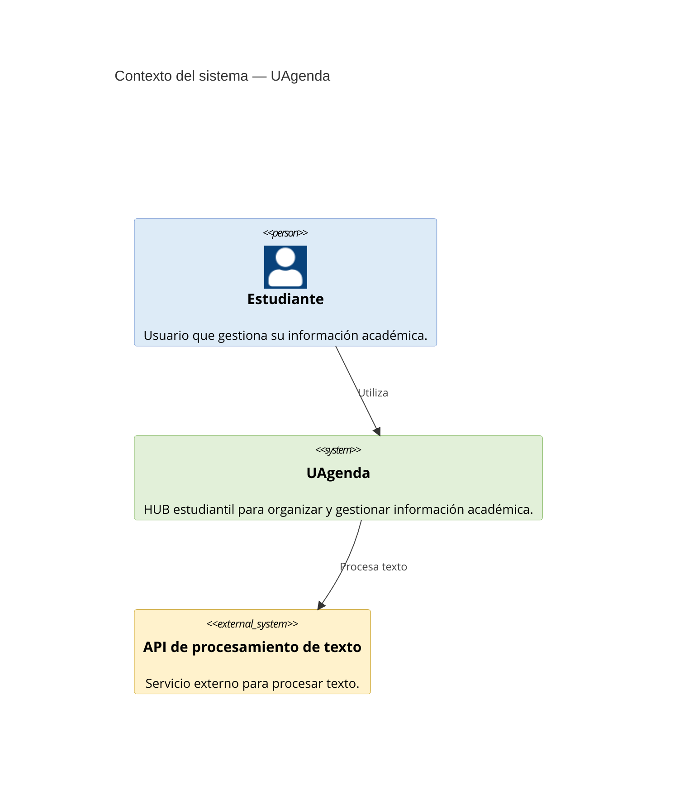

```mermaid
    C4Context
    title Contexto del sistema — UAgenda

    Person(estudiante, "Estudiante", "Usuario que gestiona su información académica.")

    System(uagenda, "UAgenda", "HUB estudiantil para organizar y gestionar información académica.")

    System_Ext(textApi, "API de procesamiento de texto", "Servicio externo para procesar texto.")

    Rel(estudiante, uagenda, "Utiliza")
    Rel(uagenda, textApi, "Procesa texto")

    UpdateElementStyle("estudiante", $bgColor="#DDEBF7", $fontColor="#000000", $borderColor="#4472C4")
    UpdateElementStyle("uagenda", $bgColor="#E2F0D9", $fontColor="#000000", $borderColor="#70AD47")
    UpdateElementStyle("textApi", $bgColor="#FFF2CC", $fontColor="#000000", $borderColor="#BF9000")
```