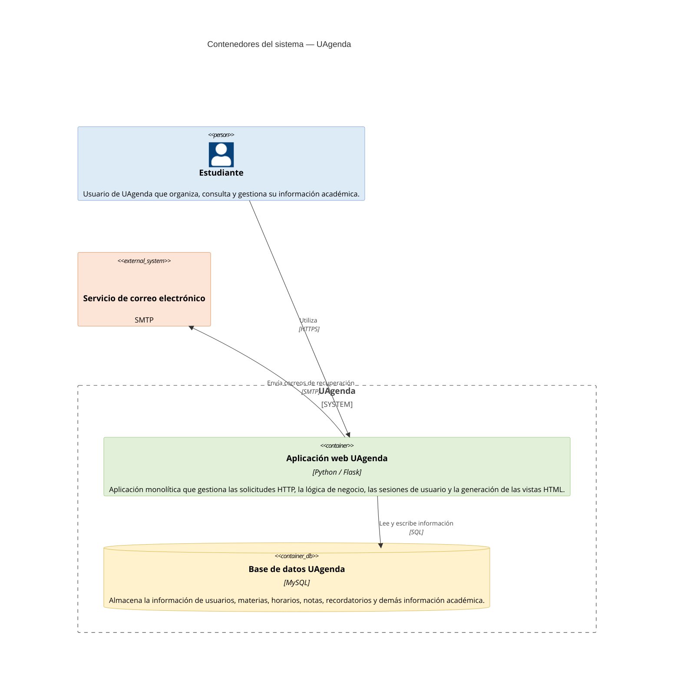

```mermaid
    C4Container
    title Contenedores del sistema — UAgenda

    Person(estudiante, "Estudiante", "Usuario de UAgenda que organiza, consulta y gestiona su información académica.")

    System_Boundary(uagenda, "UAgenda") {
        Container(webapp, "Aplicación web UAgenda", "Python / Flask", "Aplicación monolítica que gestiona las solicitudes HTTP, la lógica de negocio, las sesiones de usuario y la generación de las vistas HTML.")
        ContainerDb(database, "Base de datos UAgenda", "MySQL", "Almacena la información de usuarios, materias, horarios, notas, recordatorios y demás información académica.")
    }

    System_Ext(mail, "Servicio de correo electrónico", "SMTP", "Servicio externo utilizado para enviar correos asociados a la recuperación de cuentas.")

    Rel(estudiante, webapp, "Utiliza", "HTTPS")
    Rel(webapp, database, "Lee y escribe información", "SQL")
    Rel(webapp, mail, "Envía correos de recuperación", "SMTP")

    UpdateElementStyle("estudiante", $bgColor="#DDEBF7", $fontColor="#000000", $borderColor="#4472C4")
    UpdateElementStyle("webapp", $bgColor="#E2F0D9", $fontColor="#000000", $borderColor="#70AD47")
    UpdateElementStyle("database", $bgColor="#FFF2CC", $fontColor="#000000", $borderColor="#BF9000")
    UpdateElementStyle("mail", $bgColor="#FCE4D6", $fontColor="#000000", $borderColor="#C55A11")
```