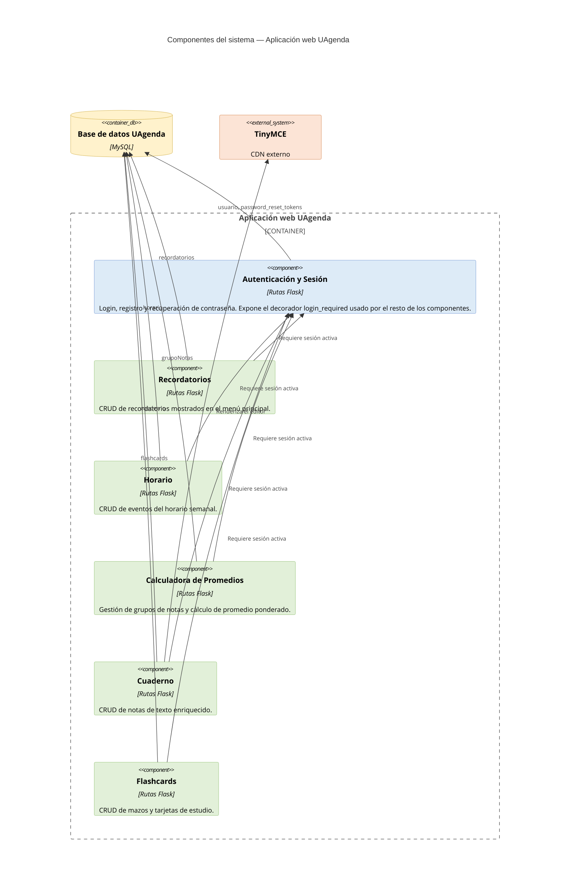

```mermaid
    C4Component
    title Componentes del sistema — Aplicación web UAgenda

    Container_Boundary(webapp, "Aplicación web UAgenda") {
        Component(auth, "Autenticación y Sesión", "Rutas Flask", "Login, registro y recuperación de contraseña. Expone el decorador login_required usado por el resto de los componentes.")
        Component(recordatorios, "Recordatorios", "Rutas Flask", "CRUD de recordatorios mostrados en el menú principal.")
        Component(horario, "Horario", "Rutas Flask", "CRUD de eventos del horario semanal.")
        Component(calculadora, "Calculadora de Promedios", "Rutas Flask", "Gestión de grupos de notas y cálculo de promedio ponderado.")
        Component(cuaderno, "Cuaderno", "Rutas Flask", "CRUD de notas de texto enriquecido.")
        Component(flashcards, "Flashcards", "Rutas Flask", "CRUD de mazos y tarjetas de estudio.")
    }

    ContainerDb(database, "Base de datos UAgenda", "MySQL")
    System_Ext(tinymce, "TinyMCE", "CDN externo")

    Rel(recordatorios, auth, "Requiere sesión activa")
    Rel(horario, auth, "Requiere sesión activa")
    Rel(calculadora, auth, "Requiere sesión activa")
    Rel(cuaderno, auth, "Requiere sesión activa")
    Rel(flashcards, auth, "Requiere sesión activa")

    Rel(auth, database, "usuario, password_reset_tokens")
    Rel(recordatorios, database, "recordatorios")
    Rel(horario, database, "horario")
    Rel(calculadora, database, "grupoNotas")
    Rel(cuaderno, database, "cuaderno")
    Rel(flashcards, database, "flashcards")

    Rel(cuaderno, tinymce, "Renderiza el editor")

    UpdateElementStyle(auth, $bgColor="#DDEBF7", $fontColor="#000000", $borderColor="#4472C4")
    UpdateElementStyle(recordatorios, $bgColor="#E2F0D9", $fontColor="#000000", $borderColor="#70AD47")
    UpdateElementStyle(horario, $bgColor="#E2F0D9", $fontColor="#000000", $borderColor="#70AD47")
    UpdateElementStyle(calculadora, $bgColor="#E2F0D9", $fontColor="#000000", $borderColor="#70AD47")
    UpdateElementStyle(cuaderno, $bgColor="#E2F0D9", $fontColor="#000000", $borderColor="#70AD47")
    UpdateElementStyle(flashcards, $bgColor="#E2F0D9", $fontColor="#000000", $borderColor="#70AD47")
    UpdateElementStyle(database, $bgColor="#FFF2CC", $fontColor="#000000", $borderColor="#BF9000")
    UpdateElementStyle(tinymce, $bgColor="#FCE4D6", $fontColor="#000000", $borderColor="#C55A11")
```