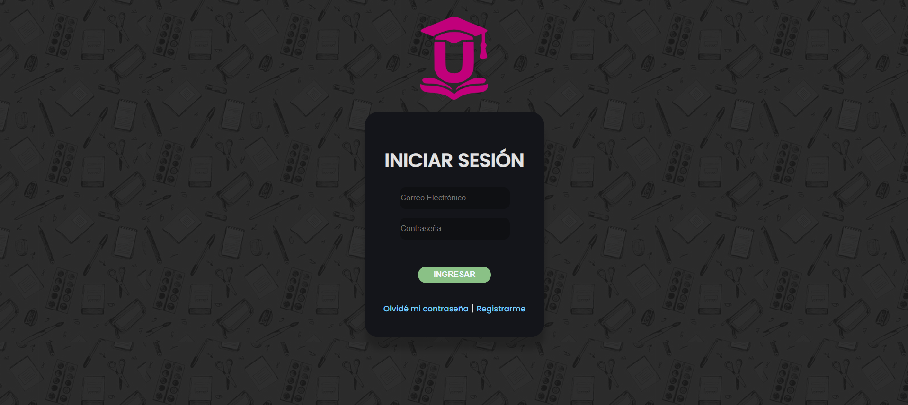
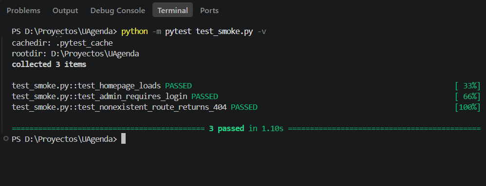

# Evidencias — Checkpoint Semana 2: UAgenda

## 1. Checkpoint de línea base operativa

## 2. Inventario de riesgos

Lista inicial generada con apoyo de IA (Claude), a partir de patrones
encontrados revisando el código real de `main.py` y el frontend durante
el proceso de retomar el proyecto. Cada riesgo se clasifica según:

- **Válido** — real y específico de UAgenda, confirmado contra el código.
- **Genérico** — técnicamente cierto, pero aplica a cualquier app; poco
  accionable tal cual está redactado.
- **Irrelevante** — no importa para el alcance de esta entrega o este
  sistema en particular.
- **Falso** — la IA se equivocó o asumió algo que no es cierto al
  chequearlo contra el código real.

| # | Riesgo sugerido por la IA | Clasificación | Justificación |
|---|---|---|---|
| 1 | Inyección SQL en rutas de `main.py` que arman queries con f-strings interpolando input del usuario sin sanitizar | Se considera muy importante. | |
| 2 | Borrado de recursos vía `GET` (`/remindRemove`, `/eventRemove`) en vez de `POST`/`DELETE` — riesgo de CSRF y borrado accidental por prefetch del navegador | Se considera importante. | |
| 3 | Dependencia de un CDN externo (TinyMCE) para una funcionalidad core (Cuaderno) | No de inmediata importancia | |
| 4 | Falta de diseño responsive para móviles en la mayoría de las vistas | Importante | |
| 5 | `/admin` (y rutas protegidas similares) devuelven status `200` en vez de `302`/`401` cuando no hay sesión activa | **Válido** (reclasificado como riesgo de mantenibilidad, no de seguridad) | Verificado con `test_smoke.py`: la ruta no expone datos protegidos —sustituye el contenido por la página de login—, así que **no es una brecha de seguridad explotable**. El riesgo real es de consistencia/mantenibilidad: no seguir la convención HTTP esperada (redirect o 401) puede confundir a futuros desarrolladores o pruebas que asuman ese comportamiento estándar. La hipótesis inicial de la IA ("bug de seguridad") fue corregida al revisar el código de `login_required` en `main.py`. |

## 3. Registro crítico del proceso con IA

La IA expone nuestras preocupaciones más importantes y las enumera en un buen orden de trabajo a la hora de la reparación pertinente.