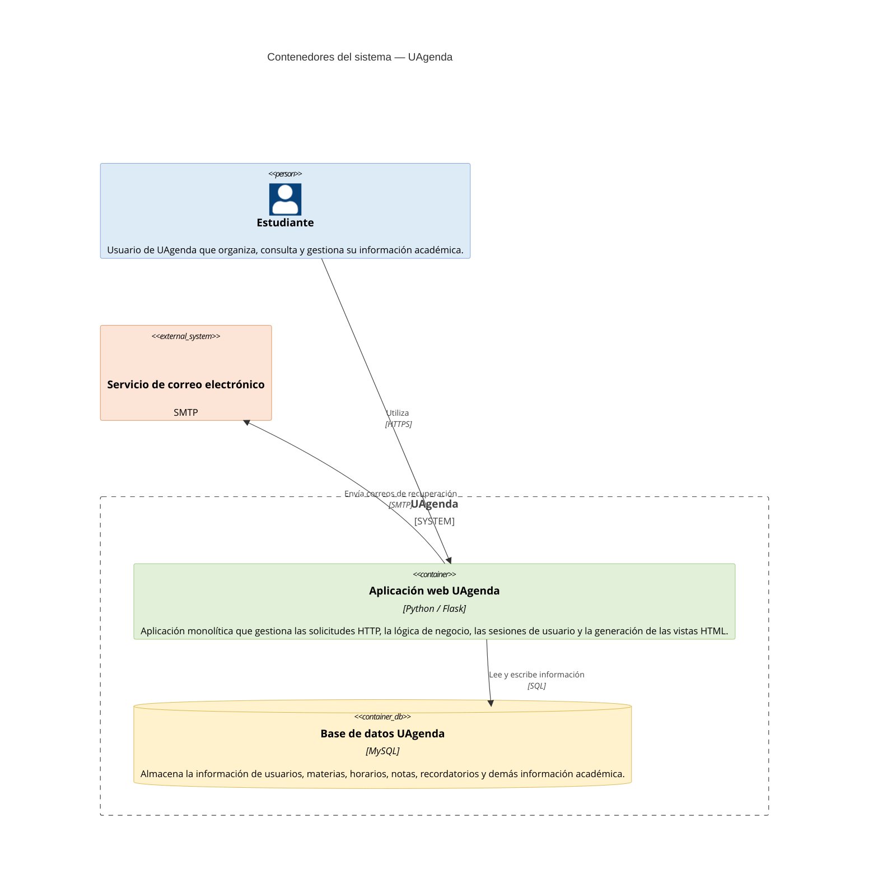

    # Modelo C4 — UAgenda

    ## Nivel 1: Contexto de la aplicación

    UAgenda es un **HUB estudiantil** orientado a centralizar y facilitar la
    gestión de la organización académica de los estudiantes. La aplicación
    permite reunir en un mismo entorno información relacionada con su
    actividad académica, evitando que esta deba ser gestionada de manera
    dispersa entre diferentes herramientas y medios.

    El sistema está dirigido enteramente a estudiantes, quienes interactúan
    con UAgenda para consultar, organizar y gestionar los diferentes
    elementos de su vida académica, como lo son su horario académico, sus
    notas y promedios, sus apuntes, sus eventos próximos e incluso sus
    métodos de estudio. De esta manera, UAgenda funciona como un punto
    central desde el cual el estudiante puede mantener organizada su
    información y dar seguimiento a sus actividades.

    Su propósito principal es proporcionar una plataforma unificada que
    simplifique la organización académica y permita al estudiante gestionar
    su información de manera estructurada desde un único sistema.

    **Referencias:**
    - [01-contexto-sistema.md](https://github.com/TiliAyala03/UAgenda-dossier/blob/main/01-contexto-sistema.md)
    - [02-stakeholders-drivers.md](https://github.com/TiliAyala03/UAgenda-dossier/blob/main/02-stakeholders-drivers.md)

    ---

    ## Nivel 2: Contenedores de la aplicación

    El segundo nivel del modelo C4 describe los contenedores que componen
    UAgenda, es decir, las unidades principales que ejecutan, almacenan o
    soportan las responsabilidades del sistema. A diferencia del diagrama
    de contexto, que presenta a UAgenda como una única unidad frente a sus
    usuarios y sistemas externos, este nivel permite observar cómo está
    construido internamente y cómo se distribuyen sus responsabilidades.

    La implementación actual de UAgenda corresponde principalmente a una
    **arquitectura monolítica basada en Flask**. El sistema no cuenta con
    un frontend independiente ni con una API separada: la aplicación Flask
    recibe las solicitudes HTTP, ejecuta la lógica correspondiente, consulta
    o modifica la información persistida y finalmente genera las respuestas
    utilizando plantillas HTML. En el repositorio, `main.py` concentra la
    creación de la aplicación, la configuración de sus dependencias y las
    diferentes rutas que atienden las funcionalidades del sistema.

    ### Aplicación web UAgenda

    El principal contenedor del sistema es la **aplicación web UAgenda**,
    implementada en Python mediante Flask. Este contenedor concentra tanto
    el procesamiento de las solicitudes como buena parte de la lógica de
    negocio de la aplicación.

    Flask se encarga de recibir las peticiones del estudiante y dirigirlas
    hacia las funciones correspondientes mediante sus rutas. Entre ellas se
    encuentran las relacionadas con el inicio de sesión, la recuperación de
    contraseña, la página principal, el horario, la creación y eliminación
    de eventos y la calculadora académica. El sistema también utiliza
    sesiones de Flask para mantener el estado de autenticación del usuario.

    La interfaz no se construye mediante un framework frontend
    independiente. En cambio, Flask utiliza las plantillas almacenadas en
    el directorio `templates` y las entrega mediante `render_template()`.
    Por ejemplo, las rutas del sistema generan directamente vistas como
    `index.html`, `admin.html` y `schedule.html`, pasando desde el backend
    los datos que deben ser mostrados al estudiante. Esto hace que la
    presentación y el procesamiento de las solicitudes formen parte del
    mismo contenedor monolítico.

    Dentro de este mismo contenedor se encuentran las principales
    funcionalidades de UAgenda, incluyendo la autenticación de usuarios,
    gestión del horario, recordatorios, manejo de notas y grupos de notas,
    cuadernos y otras herramientas académicas. Estas funcionalidades no
    están desplegadas como servicios independientes, sino que forman parte
    de la misma aplicación Flask.

    ### Base de datos MySQL

    El segundo contenedor fundamental es la **base de datos MySQL**,
    responsable de la persistencia de la información de UAgenda.

    La aplicación se conecta a una instancia MySQL mediante
    `Flask-MySQLdb` y utiliza el esquema `prflask`. El código obtiene
    conexiones y cursores desde la extensión `mysql`, ejecutando consultas
    SQL para recuperar, insertar, actualizar y eliminar información.

    La base de datos almacena información perteneciente a diferentes
    aspectos de la aplicación, entre ellos usuarios, materias, horarios,
    recordatorios, notas y elementos relacionados con las herramientas de
    estudio. El modelo documentado en el dossier muestra estas relaciones
    entre las entidades persistentes, por lo que sirve como soporte para
    comprender qué tipo de información maneja este contenedor.

    En el estado actual del proyecto, esta base de datos debe ejecutarse
    **localmente** para poner en funcionamiento el sistema. El README del
    repositorio indica explícitamente que la base de datos no se encuentra
    desplegada y que el esquema `prflask` debe ser creado mediante MySQL y
    cargado utilizando el archivo SQL incluido en el repositorio.

    **Referencia:** [diagramas.md](https://github.com/TiliAyala03/UAgenda-dossier/blob/main/diagramas.md)

    ### Servicio de correo electrónico

    UAgenda también incorpora una integración con un servidor SMTP de
    Gmail mediante `Flask-Mail`. Esta integración se encuentra configurada
    dentro de la misma aplicación Flask, por lo que Flask-Mail **no
    constituye un contenedor independiente** de UAgenda, sino una
    biblioteca que permite al contenedor principal comunicarse con un
    servicio externo.

    El código configura el servidor `smtp.gmail.com` utilizando el puerto
    `587` y TLS, inicializa Flask-Mail y utiliza esta integración en el
    flujo de recuperación de contraseña. Durante este proceso, UAgenda
    genera un token, lo almacena en MySQL y construye un enlace de
    recuperación que posteriormente es enviado al correo del usuario.

    Por esta razón, en el modelo C4 el servidor de correo debe
    representarse como un **sistema externo**, mientras que Flask-Mail
    permanece como parte de la implementación interna de la aplicación.

    ### Dependencias externas de la interfaz

    Además de MySQL y el servicio de correo, la interfaz de UAgenda
    utiliza algunas dependencias externas cargadas desde CDN, como
    **TinyMCE** para la edición enriquecida de contenido, junto con otras
    bibliotecas utilizadas por las vistas.

    Estas dependencias no constituyen contenedores internos de UAgenda.
    Desde la perspectiva del modelo C4, representan sistemas o servicios
    externos con los que la aplicación puede interactuar. El dossier
    identifica específicamente a TinyMCE como una dependencia externa
    utilizada en la sección de Cuaderno/Apuntes, además de otras
    bibliotecas y recursos cargados desde CDN.

    ### Resumen de la estructura

    Por lo tanto, el Nivel 2 de UAgenda puede entenderse conceptualmente
    como una aplicación monolítica que concentra la lógica y la
    presentación, conectada a servicios externos:

    - **Aplicación web UAgenda** — contenedor principal. Implementado con
    Python y Flask. Atiende las solicitudes HTTP, ejecuta la lógica de
    la aplicación, gestiona sesiones y genera las vistas HTML.
    - **Base de datos MySQL** — contenedor de persistencia. Almacena la
    información necesaria para usuarios y funcionalidades académicas.
    - **Servidor SMTP de Gmail** — sistema externo utilizado por la
    aplicación para el envío de correos asociados al proceso de
    recuperación de contraseña.
    - **Servicios/API externos** — recursos utilizados por determinadas
    funcionalidades de la interfaz, como TinyMCE.


 ```mermaid
    C4Container
        title Contenedores del sistema — UAgenda

        Person(estudiante, "Estudiante", "Usuario de UAgenda que organiza, consulta y gestiona su información académica.")

        System_Boundary(uagenda, "UAgenda") {
            Container(webapp, "Aplicación web UAgenda", "Python / Flask", "Aplicación monolítica que gestiona las solicitudes HTTP, la lógica de negocio, las sesiones de usuario y la generación de las vistas HTML.")
            ContainerDb(database, "Base de datos UAgenda", "MySQL", "Almacena la información de usuarios, materias, horarios, notas, recordatorios y demás información académica.")
        }

        System_Ext(mail, "Servicio de correo electrónico", "SMTP", "Servicio externo utilizado para enviar correos asociados a la recuperación de cuentas.")

        Rel(estudiante, webapp, "Utiliza", "HTTPS")
        Rel(webapp, database, "Lee y escribe información", "SQL")
        Rel(webapp, mail, "Envía correos de recuperación", "SMTP")

        UpdateElementStyle("estudiante", $bgColor="#DDEBF7", $fontColor="#000000", $borderColor="#4472C4")
        UpdateElementStyle("webapp", $bgColor="#E2F0D9", $fontColor="#000000", $borderColor="#70AD47")
        UpdateElementStyle("database", $bgColor="#FFF2CC", $fontColor="#000000", $borderColor="#BF9000")
        UpdateElementStyle("mail", $bgColor="#FCE4D6", $fontColor="#000000", $borderColor="#C55A11")
```

